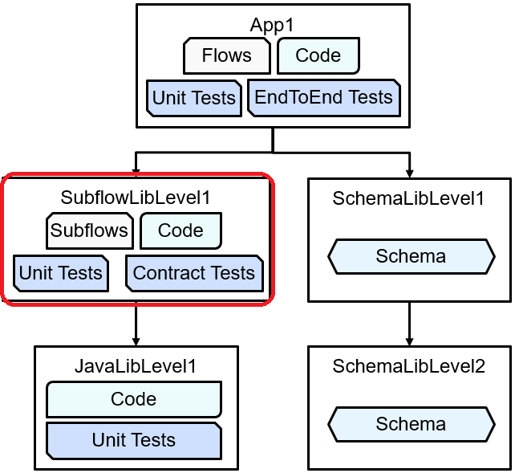
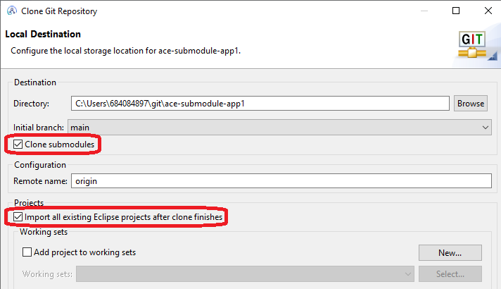

# ace-submodule-subflowlib-level1

ACE submodule subflow library level1, providing a shared libary to the
main application and relying on a Java submodule.

This is a mid-level library in a hierarchy of repositories:



App repo: https://github.com/trevor-dolby-at-ibm-com/ace-submodule-app1

Java library: https://github.com/trevor-dolby-at-ibm-com/ace-submodule-javalib-level1

Originally created for a [blog post](https://community.ibm.com/community/user/integration/blogs/trevor-dolby/2023/04/03/automated-multi-repo-app-connect-enterprise-ace-ba).

## Tests

This repo contains two types of tests, ensuring both that the code in the library
is working as expected and also that the library meets the requirements of the 
application using it. As shared libraries cannot be tested directly, these tests
use the "ScaffoldApp" to instantiate the library so subflows can be tested.

#### Unit tests

Tests the main Compute node the subflow to make sure it is adding the correct 
header; tests could be extended to other nodes to enhance this repo.

#### Contract tests

Tests the subflow using data from the application itself to ensure the interface
does not change unexpectedly. If these tests fail, then they should only be changed 
with the agreement of the application repo team.

## Local build

Clone and build as follows:
```
git clone --recursive git@github.com:trevor-dolby-at-ibm-com/ace-submodule-subflowlib-level1.git
cd ace-submodule-subflowlib-level1
./build-and-ut.sh
./build-and-run-contract-tests.sh
```

Update submodule with `git submodule update --remote --merge --recursive`

## Toolkit

When importing this repo into the toolkit, the "Clone submodules" and "Import all
existing Eclipse projects after clone finishes" boxes should be selected (shown 
here for the parent application):



After that has completed, all the projects should appear as usual, with the test
projects able to run successfully and development proceeding as normal.

## GitHub Action

Runs the build and test scripts automatically on pull requests.
